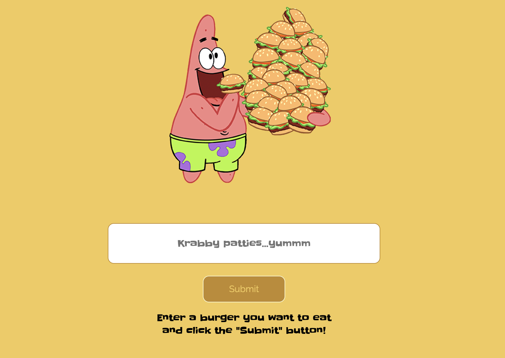

# Eat-Da-Burger!

 

Eat-Da-Burger! is a restaurant app that lets users input the names of burgers they'd like to eat.

## Installation

1. Download or clone repository
2. Node.js is required to run the application
3. `npm install` to install the required npm packages

## Usage

* Application will be invoked by using the following command:
  
  `node server.js`

* Open your browser and go to

  `http://localhost:8080`

  

* Whenever a user submits a burger's name, the app will display the burger on the left side of the page -- indicating the burger is waiting to be devoured.

* Each burger in the waiting area has a `Devour it!` button. When the user clicks it, the burger will move to the right side of the page.

* Each burger on the right area also has a `Delete it!` button. When the user clicks it, the burger will be removed. 

* The app stores every burger in a database, whether devoured or not.

* Websites
  * [Github](https://github.com/mmeii/eat-da-burger)
  * [Live Heroku App](https://cryptic-reef-17921.herokuapp.com/)

## Features

* JavaScript
* MySQL
* Node
* Express
* Handlebars
* Homemade ORM

## License

  Copyright (c) Mengmei Tu. All rights reserved.
  
  Licensed under the [MIT](LICENSE) license.
